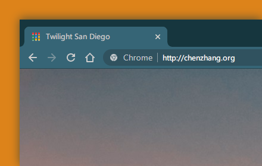

# Chrome Theme Pack

This project contains several customized themes for Chrome browser.

## Classic in Dark

A dark version of classic Chrome blue theme.

Have been using the classic theme for years but cannot find a dark version. So I made one.

**Screenshot**

**Installation**

Install theme at [Chrome Web Store](https://chrome.google.com/webstore/detail/classic-in-dark/ilbiklogjdhcbejjklhhcmaegbmndpln?hl=en-US)

**Source code** 

[https://github.com/czhang11/chrome-theme-pack/tree/main/classic-in-dark/src](https://github.com/czhang11/chrome-theme-pack/tree/main/classic-in-dark/src)

**Update history**

Version 1.1.0 - Update the theme metadata.

## Twilight San Diego

A twilight theme with an ocean view at San Diego.

Image taken at Sunset Cliffs, San Diego

Image size: 2560*1440

**Screenshot**

**Installation**

Install theme at [Chrome Web Store](https://chrome.google.com/webstore/detail/twilight_san_diego/ggegcpgjkliifijpnfnmlgjmcjmidaec?hl=en-US)

**Source code**

[https://github.com/czhang11/chrome-theme-pack/tree/main/twilight_san_diego/src](https://github.com/czhang11/chrome-theme-pack/tree/main/twilight_san_diego/src)

**Update history**

Version 1.1.1 - The decode problem is still there in version 1.1.0. Change the color profile from Display P3 to sRGB and resize the image in this version.

Version 1.1.0 - Change the image format to PNG to fix the "Could not decode image" issue.

