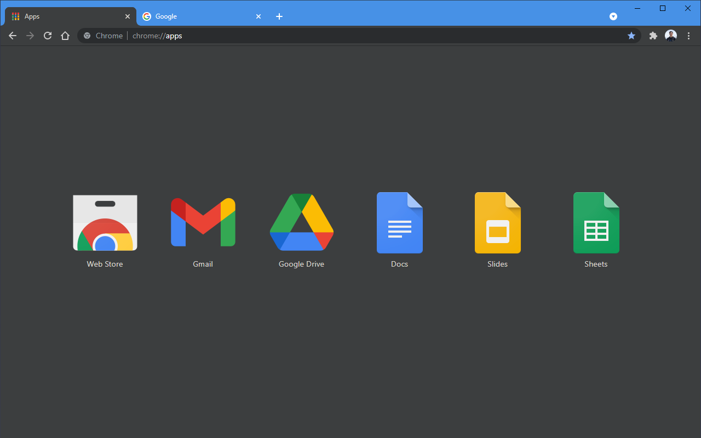

## Classic in Dark

A dark version of classic Chrome blue theme.

Have been using the classic theme for years but cannot find a dark version. So I made one.

**Screenshot**

**Installation**

Install theme at [Chrome Web Store](https://chrome.google.com/webstore/detail/classic-in-dark/ilbiklogjdhcbejjklhhcmaegbmndpln?hl=en-US)

**Source code** 

[https://github.com/czhang11/chrome-theme-pack/tree/main/classic-in-dark/src](https://github.com/czhang11/chrome-theme-pack/tree/main/classic-in-dark/src)

**Update history**

Version 1.1.0 - Update the theme metadata.

